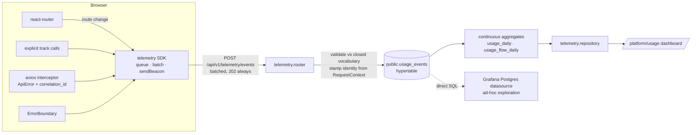

# Product & Engagement Telemetry — Implementation Plan

**Status:** proposal · **Date:** 2026-08-02 · **Owner:** platform

Answers to: *how is the solution used, where do users spend time, which capabilities
matter, and where do users struggle?*

---

## 0. Decisions locked before writing this

| Decision | Choice | Consequence |
|---|---|---|
| Where data lives | **First-party, TimescaleDB in-cluster** | No new infra $, no vendor egress of customer data. We build the query + chart layer. |
| Primary consumer | **Platform team only** (internal) | One platform-admin surface. No tenant-facing API contract, no small-N suppression, no DPA change *yet*. |
| Identity grain | **Full identity** — `user_id` + `tenant_id` + role | Retention curves, per-role funnels, per-user support forensics. Requires a stated retention policy. |
| "Struggle" definition | **Derived from events + API signals** | No session replay, no rage-click SDK in MVP. Everything comes from the event stream and the axios error path we already have. |

Everything below follows from those four.

---

## 1. What already exists — and why none of it answers the question

I checked before designing. The picture is unusually favourable:

| Asset | State | Usable for this? |
|---|---|---|
| `backend/app/modules/analytics/` | **Empty placeholder.** `service.py` / `events.py` are docstring-only with `# TODO: prompt 2-5` | **No — different concern.** `data_model.md § 14` specs `analytics` as *agronomic* analytics: CAGGs over `block_index_aggregates` / `weather_observations` / `alerts_history` plus operational views. Most of that shipped inside the owning modules instead (`block_index_daily`, `block_index_weekly`, `v_farm_integration_health`). Reusing the name for engagement telemetry would collide. **We add `app/modules/telemetry/` instead** — see §2.2. |
| `backend/app/modules/audit/` | Real. `audit_events` Timescale hypertable per tenant + `public.audit_events_archive` | **No.** It is a *mutation* trail — who changed what. Zero navigation, zero dwell, zero read-path activity. A user can spend three hours in Insights and produce not one audit row. Keep the two separate: audit answers *"who deleted this block"*, telemetry answers *"nobody opens Reports"*. |
| `audit_events` migration (`tenant/0001`) | hypertable + compression@60d + retention@730d + 5 indexes | **Yes, as a template.** It is the exact shape our migration should copy. |
| Correlation IDs | `CorrelationIdMiddleware` — `X-Correlation-ID` on every request, echoed on the response, in OTel baggage and structlog | **Yes, and it's the keystone.** It lets a client-side `api_error` event join to the server log line and the trace. Very few products get this for free. |
| `apiClient` interceptor (`frontend/src/api/client.ts`) | Already lifts RFC-7807 problems into `ApiError` **and already reads `x-correlation-id` off the response** | **Yes.** The error-capture hook is one function call away from existing code. |
| `RequestContext` (`shared/auth/context.py`) | `user_id`, `tenant_id`, `tenant_role`, `platform_role`, `farm_scopes`, `preferred_language` | **Yes.** The server can stamp full identity on every event — the client never sends it. |
| Prometheus + `prometheus-fastapi-instrumentator` | Live in `core/observability.py`, RED metrics per route | **Yes, for *server* latency.** Don't duplicate it in the event stream. |
| Grafana / Loki / Tempo / GlitchTip | Declared in `infra/argocd/appsets/observability.yaml` | **Verify before relying on it.** `platform-values/kube-prometheus-stack.yaml` still asks for storageClass `gp3` and ingress `grafana.dev.agripulse.local` — both AWS-era. This stack likely is not healthy on the Hetzner node. See §11. |
| React error boundary | **Does not exist.** No `componentDidCatch` anywhere in `frontend/src` | A gap in its own right: an uncaught render error white-screens with no signal at all. TEL-4 fixes it *and* makes it a telemetry source. |
| Frontend build version | **Not defined.** No `define` block in `vite.config.ts` | Needed to attribute a regression to a deploy. TEL-3 adds it. |

---

## 2. Architecture



Two properties are non-negotiable:

1. **The client never asserts identity.** It sends `session_id` and event bodies. The
   server stamps `user_id` / `tenant_id` / `actor_role` / `is_platform_staff` from the
   validated JWT. A tampered client can pollute its *own* row, never someone else's.
2. **Telemetry can never break the app.** The endpoint returns `202` unconditionally.
   The SDK swallows every failure, caps its queue, and drops on overflow.

### 2.1 Why `public`, not the per-tenant schema

`audit_events` is per-tenant. Telemetry should **not** be, and this is the one structural
call worth arguing:

- Every question we actually have is **cross-tenant** ("which feature is most used",
  "which tenant is going quiet"). Per-tenant would mean a dynamically generated
  `UNION ALL` over N schemas for every dashboard query, plus creating a fresh CAGG
  set on every tenant provision.
- **Platform staff have no `tenant_id`.** Our own usage would have nowhere to land — and
  we specifically need to *exclude* it, which means we must first *record* it.
- Pre-auth events (login page, failed sign-in) have no tenant either.
- One hypertable = one compression policy, one retention policy, one CAGG set. On a
  single k3s node that matters.
- Precedent exists: `public.audit_events_archive`, `public.backfill_runs`,
  `public.farm_scopes`, `public.decision_trees` all live in `public` and carry tenant/farm
  references.

**Cost of this choice:** `public.usage_events` carries `tenant_id` and `farm_id`, so the
purge guard test will demand it be registered. See §6.

### 2.2 A new `telemetry` module, not `analytics`

`data_model.md § 14` already gives `analytics` a meaning: CAGGs and views over the
*agronomic* hypertables (`block_index_daily`, `weather_hourly`,
`alert_rule_daily_count`, `v_active_alerts`). Most of that shipped, but inside the
modules that own the source tables rather than in `analytics/` — which is why the
directory is still two docstrings. Product telemetry is a different concern with a
different lifecycle, a different consumer, and a different privacy posture.

So: **add `backend/app/modules/telemetry/`** and leave `analytics/` alone as the
still-unfilled home for domain analytics (or delete it separately — out of scope here).

Consequence: the existing `"analytics internals are private"` import-linter contract does
**not** cover us. TEL-2 adds a parallel contract:

```toml
[[tool.importlinter.contracts]]
name = "telemetry internals are private"
type = "forbidden"
source_modules = [ ... every domain module ... ]
forbidden_modules = [
  "app.modules.telemetry.repository",
  "app.modules.telemetry.models",
  "app.modules.telemetry.router",
  "app.modules.telemetry.schemas",
]
allow_indirect_imports = true
```

Note the direction: nothing needs to import telemetry. The client posts to its router and
the dashboard reads from its repository. It is a leaf — no domain module should ever call
it, and the contract enforces that. Frontend `track()` calls are the only instrumentation
surface, which keeps the backend blast radius at zero.

---

## 3. Data model

`backend/migrations/public/versions/0049_usage_events.py`

```sql
CREATE TABLE public.usage_events (
    time            timestamptz  NOT NULL,
    id              uuid         NOT NULL,          -- uuid7, client-generated (idempotency)
    schema_version  smallint     NOT NULL DEFAULT 1,

    -- identity: server-stamped, never client-supplied
    session_id      uuid         NOT NULL,
    user_id         uuid,                            -- NULL only for pre-auth (phase B)
    tenant_id       uuid,                            -- NULL for platform staff
    actor_role      text,                            -- TenantAdmin | Agronomist | PlatformAdmin | ...
    is_platform_staff boolean    NOT NULL DEFAULT false,

    -- what happened
    event_name      text         NOT NULL,           -- closed vocabulary, §4
    feature         text,                            -- closed enum, §4.2
    route           text,                            -- route TEMPLATE, never a resolved path
    farm_id         uuid,
    flow            text,                            -- funnel id, when part of one
    step            text,

    -- outcome + timing
    outcome         text,                            -- ok | error | abandoned | cancelled
    duration_ms     integer,                         -- dwell for page_leave, latency for actions
    status_code     smallint,
    error_code      text,

    -- context
    correlation_id  uuid,                            -- joins to server logs + traces
    locale          text,                            -- en | ar
    app_version     text,
    device_kind     text,                            -- desktop | tablet | mobile
    viewport_w      smallint,

    props           jsonb        NOT NULL DEFAULT '{}'::jsonb,

    CONSTRAINT uq_usage_events_time_id UNIQUE (time, id),
    CONSTRAINT ck_usage_events_outcome
        CHECK (outcome IS NULL OR outcome IN ('ok','error','abandoned','cancelled'))
);

SELECT create_hypertable('public.usage_events', 'time',
    chunk_time_interval => INTERVAL '7 days', if_not_exists => TRUE);

ALTER TABLE public.usage_events SET (
    timescaledb.compress,
    timescaledb.compress_segmentby = 'tenant_id',
    timescaledb.compress_orderby   = 'time DESC'
);
SELECT add_compression_policy('public.usage_events', INTERVAL '14 days', if_not_exists => TRUE);
SELECT add_retention_policy ('public.usage_events', INTERVAL '180 days', if_not_exists => TRUE);
```

Indexes (mirroring the `audit_events` pattern — partial where the column is sparse):

```sql
CREATE INDEX ix_usage_events_tenant_time   ON public.usage_events (tenant_id, time DESC)
    WHERE tenant_id IS NOT NULL;
CREATE INDEX ix_usage_events_user_time     ON public.usage_events (user_id, time DESC)
    WHERE user_id IS NOT NULL;
CREATE INDEX ix_usage_events_name_time     ON public.usage_events (event_name, time DESC);
CREATE INDEX ix_usage_events_feature_time  ON public.usage_events (feature, time DESC)
    WHERE feature IS NOT NULL;
CREATE INDEX ix_usage_events_session       ON public.usage_events (session_id, time);
CREATE INDEX ix_usage_events_correlation   ON public.usage_events (correlation_id)
    WHERE correlation_id IS NOT NULL;
```

### Design notes that are easy to get wrong

- **`route` is a template**, `/insights/:farmId`, never `/insights/8f3a-…`. Resolved paths
  make grouping impossible and smuggle IDs into a text column. The ID goes in `farm_id`.
  React-router gives us the template directly — see §5.2.
- **`is_platform_staff`** exists so our own clicking can be excluded with a `WHERE`.
  Without it, on a pilot-scale product, *we* are the top user and every chart lies.
- **`locale`** is worth the column. There is an active Arabic/RTL rollout; "do Arabic users
  abandon this flow more?" becomes a one-line filter.
- **`app_version`** attributes a behaviour change to a deploy. Requires the vite `define`
  in TEL-3.
- **No `client_ip`, no `user_agent` string.** `audit_events` already carries those for the
  security trail. Telemetry doesn't need them, and `device_kind` + `viewport_w` answer the
  only product question ("is anyone on a phone in the field?") without the fingerprint.
- **`props` is allow-listed**, not free-form. See §8.2.

---

## 4. Event taxonomy

A closed vocabulary, validated server-side. This is the single highest-leverage
decision in the whole plan: an open `track(anything)` API produces 400 event names in
six months and an unqueryable table.

### 4.1 Event names (MVP — 10)

| `event_name` | Fires when | Key fields | Answers |
|---|---|---|---|
| `session_start` | SDK init after auth | `locale`, `device_kind`, `app_version` | sessions, DAU/WAU/MAU |
| `session_end` | 30 min idle, or tab close | `duration_ms` | session length |
| `page_view` | Route committed | `route`, `farm_id` | where they go |
| `page_leave` | Route change / tab hidden / unload | `route`, `duration_ms` | **where they spend time** |
| `feature_used` | Explicit `track()` on a meaningful action | `feature`, `props` | **most-used capability** |
| `flow_start` | Entering a tracked funnel | `flow` | funnel entry |
| `flow_step` | Advancing a funnel | `flow`, `step` | drop-off point |
| `flow_complete` | Funnel succeeded | `flow`, `duration_ms` | conversion |
| `api_error` | Axios interceptor rejects | `route`, `status_code`, `error_code`, `correlation_id` | **struggle** |
| `client_error` | ErrorBoundary / `window.onerror` | `route`, `error_code` | **struggle** |

`flow_abandon` is *derived*, not emitted — a `flow_start` with no matching
`flow_complete` inside the flow's timeout. Emitting it from the client is unreliable
(the user closes the laptop) and would undercount exactly the cases we care about.

### 4.2 Feature enum (MVP)

One entry per capability we would actually make a roadmap decision about. Deliberately
coarse — ~20, not 200. Derived by default from the route, overridable per `track()` call.

```
farm_console · farm_create · block_create · bulk_aoi_upload · block_defaults
grid_config · imagery_config · weather_config · backfill_console
insights · index_chart · weather_chart · board · plan_template
alerts · recommendations · decision_tree_authoring · decision_tree_dryrun
signals · reports · report_export · settings · users_admin · platform_admin
```

Add to the enum via PR, with the Python enum and TS union generated from one YAML file
(`backend/app/modules/telemetry/taxonomy.yaml`) so the two can't drift — the same pattern
`shared/rbac/capabilities.yaml` already uses.

### 4.3 Tracked flows (MVP — 4)

Pick flows where abandonment is *expensive* and where we already suspect friction:

| `flow` | Steps | Timeout |
|---|---|---|
| `farm_onboarding` | `draw_or_upload` → `details` → `blocks` → `subscriptions` → complete | 60 min |
| `backfill_run` | `select_farm` → `select_range` → `preview` → `submit` → complete | 30 min |
| `block_bulk_upload` | `pick_files` → `map_columns` → `reconcile` → `commit` | 30 min |
| `decision_tree_authoring` | `open` → `edit` → `dry_run` → `publish` | 120 min |

---

## 5. Client SDK

New: `frontend/src/telemetry/` — `index.ts`, `queue.ts`, `session.ts`, `routes.ts`,
`useTrack.ts`. No dependency added; ~250 LOC.

### 5.1 Queue and transport

- In-memory ring buffer, hard cap **200 events**; overflow drops oldest and increments a
  local `dropped` counter sent with the next batch (so we know when we're blind).
- Flush on: **10 events**, **15 s**, `visibilitychange → hidden`, or route change.
- Hidden/unload flush uses `navigator.sendBeacon` — `fetch` is killed on unload and would
  silently lose every `page_leave`, which is the dwell signal.
  `sendBeacon` can't set an `Authorization` header, so the beacon path posts to
  `/api/v1/telemetry/events?t=<short-lived-token>`; simplest correct option is to accept
  the access token as a query param **on that one route only**, capped at 8 KB.
  *(Alternative if we'd rather not put a token in a URL: keep a `keepalive: true` fetch,
  which does carry headers and works on unload in all our target browsers. Prefer this —
  see open question O3.)*
- Never retries a failed batch. Telemetry loss is acceptable; a retry storm is not.
- Global kill switch: `VITE_TELEMETRY_ENABLED=false` makes `track()` a no-op at module
  level, so the queue is never even allocated.

### 5.2 Route templates and dwell

```ts
// routes.ts — react-router v6 gives us the matched pattern, not the resolved path.
import { matchRoutes, useLocation } from "react-router-dom";
export function useRouteTemplate(): string {
  const location = useLocation();
  const matches = matchRoutes(ROUTE_MANIFEST, location) ?? [];
  return matches.map((m) => m.route.path).filter(Boolean).join("/") || "unknown";
}
```

`ROUTE_MANIFEST` is a flat array extracted from `App.tsx` (~60 routes). A unit test
asserts every `<Route path>` in `App.tsx` appears in the manifest, so a new page can't be
added without a route entry — otherwise it silently reports as `unknown`.

**Dwell must exclude backgrounded tabs**, or "time spent" becomes "tabs left open
overnight". Accumulate visible time only:

```ts
// on route enter        -> visibleSince = now, accumulated = 0
// on visibilitychange   -> hidden: accumulated += now - visibleSince
//                          visible: visibleSince = now
// on route leave/unload -> emit page_leave { duration_ms: accumulated + (visible ? now - visibleSince : 0) }
```

Cap `duration_ms` at 30 min per `page_leave` and discard anything above — a laptop lid
close still produces one absurd row otherwise.

### 5.3 Call sites

- `page_view` / `page_leave`: one `useTelemetryRoute()` hook mounted once in `AppShell`.
- `api_error`: three lines inside the existing `apiClient` response interceptor — it
  already has `error.response.status` and `correlationId` in scope.
- `client_error`: a new `<AppErrorBoundary>` wrapping the route outlet in `AppShell`,
  plus `window.addEventListener("error" | "unhandledrejection")`.
- `feature_used`: ~25 explicit `track()` calls. Curated, not sprayed — see TEL-5.

---

## 6. Ingest

`backend/app/modules/telemetry/router.py`

```
POST /api/v1/telemetry/events   →  202 Accepted (always)
```

- Body: `{ session_id, app_version, dropped, events: [...] }`, **max 50 events**, max 64 KB.
- Requires a valid bearer token (the standard `AuthMiddleware` path — not added to
  `_PUBLIC_PATHS`).
- Server overwrites, from `RequestContext`: `user_id`, `tenant_id`, `actor_role`,
  `is_platform_staff`, `locale` (falls back to `context.preferred_language`).
  Any of those keys present in the client payload are **discarded silently**.
- `time` is clamped: client timestamps outside `now ± 5 min` are replaced with server
  `now()`. Clock skew otherwise scatters rows into future chunks.
- Validation rejects unknown `event_name` / `feature` / `flow` against the taxonomy and
  drops just that event (counting it in a Prometheus counter), never the batch.
- `props` keys are checked against a per-event allow-list. **Unknown keys are dropped.**
  This is the single control that prevents a well-meaning PR from shipping farm names,
  block notes, or coordinates into the telemetry store.
- Rate limit: 60 batches/min/session, in-process token bucket. Excess → still `202`, but
  discarded.
- Writes with a single `INSERT ... ON CONFLICT (time, id) DO NOTHING` (`executemany`)
  so a duplicated beacon is a no-op.

> ⚠️ **Repo-specific trap.** Bind real `datetime` / `UUID` objects — never
> `.isoformat()` strings through a `CAST(:x AS timestamptz)`. This exact family of bug
> caused #331 / #332 / #335. A batch insert of 50 timestamps is a textbook place to
> reintroduce it. The integration test in TEL-1 must assert against a **real asyncpg
> connection**, not a mock, and must not be `skip`ped — 5 of 6 backfill tests were
> skipped, which is why #331 shipped broken.

### 6.1 Purge registration (mandatory — CI will fail without it)

`public.usage_events` carries `tenant_id` and `farm_id`, so the purge guard test sweeps
`information_schema`, finds both, and fails unless they're declared in
`backend/app/shared/purge/registry.py`.

Recommended: register for deletion, matching the data-protection posture.

```python
# TENANT_PUBLIC_OWNED
OwnedTable("usage_events", owner_column="tenant_id", schema="public",
           order=10, fk=False, hypertable=True,
           note="engagement telemetry; dies with the tenant"),
# FARM_OWNED (public cross-schema section, next to farm_scopes / backfill_runs)
OwnedTable("usage_events", owner_column="farm_id", schema="public",
           order=10, fk=False, hypertable=True),
```

**Trade-off, flagged:** purging a tenant then destroys the evidence of *why* they
churned. If we'd rather keep it, the archive-first pattern already used by
`audit_events_archive` applies — have purge write a `usage_tenant_summary` row before
deleting, and add that table to `EXEMPT_PAIRS` with a reason. Deferred to Phase B (B7);
MVP takes the simple, privacy-safe option.

---

## 7. Rollups

Two continuous aggregates. Both with **real-time aggregation on** (the default,
`materialized_only = false`) so today's partial data shows without waiting for a refresh.

```sql
CREATE MATERIALIZED VIEW public.usage_daily
WITH (timescaledb.continuous) AS
SELECT time_bucket('1 day', time)              AS day,
       tenant_id, user_id, actor_role, is_platform_staff,
       event_name, feature, route, locale,
       count(*)                                 AS events,
       count(*) FILTER (WHERE outcome = 'error') AS errors,
       sum(duration_ms)                         AS total_ms,
       approx_percentile(0.95, percentile_agg(duration_ms)) AS p95_ms
FROM public.usage_events
GROUP BY 1,2,3,4,5,6,7,8,9;

SELECT add_continuous_aggregate_policy('public.usage_daily',
    start_offset => INTERVAL '7 days',
    end_offset   => INTERVAL '1 hour',
    schedule_interval => INTERVAL '1 hour');
```

Plus `usage_flow_daily` over `flow` / `step` for funnels.

Keep aggregates **24 months** even though raw is 180 days — that's the whole point of the
rollup, and it's what makes year-over-year adoption answerable.

> ⚠️ **Repo-specific trap.** Rolling CAGG refresh policies never cover rows written
> *below the watermark* — the bug behind #336, where backfilled indices stayed invisible.
> Telemetry always arrives at `now`, so the rolling policy is correct here **as long as we
> never bulk-import historical events**. If we ever do, refresh manually with an explicit
> `refresh_continuous_aggregate(…, start, end)` over the imported range.

---

## 8. Struggle heuristics — concrete definitions

"Where users struggle" is only useful if it's a number. Six signals, all derivable from
the MVP event set. Each is one query in `telemetry/repository.py`.

| Signal | Definition | Threshold |
|---|---|---|
| **Error-dense surface** | `api_error + client_error` per `page_view`, grouped by `route` | flag > 5% |
| **Retry storm** | ≥3 `feature_used` with identical `(user_id, feature, props hash)` inside 60 s | any occurrence |
| **Flow abandonment** | `flow_start` with no `flow_complete` for that `(session_id, flow)` within the flow timeout | rank by count × step |
| **Pogo-sticking** | `page_leave` with `duration_ms < 3000` followed within 10 s by a `page_view` of the previous route | flag > 15% of visits to that route |
| **Slow perceived action** | p95 `duration_ms` of `feature_used` where the action awaits an API call | flag > 3 s |
| **Cold capability** | Feature in the enum with zero `feature_used` across all tenants in 30 days | the "should we delete this?" list |

Abandonment, as SQL:

```sql
WITH starts AS (
    SELECT session_id, flow, tenant_id, time AS started
    FROM public.usage_events
    WHERE event_name = 'flow_start' AND time > now() - INTERVAL '30 days'
), completes AS (
    SELECT session_id, flow, time AS completed
    FROM public.usage_events
    WHERE event_name = 'flow_complete' AND time > now() - INTERVAL '30 days'
), last_step AS (
    SELECT DISTINCT ON (session_id, flow) session_id, flow, step
    FROM public.usage_events
    WHERE event_name = 'flow_step' AND time > now() - INTERVAL '30 days'
    ORDER BY session_id, flow, time DESC
)
SELECT s.flow, l.step AS died_at, count(*) AS abandoned
FROM starts s
LEFT JOIN completes c USING (session_id, flow)
LEFT JOIN last_step  l USING (session_id, flow)
WHERE c.completed IS NULL
GROUP BY 1, 2
ORDER BY abandoned DESC;
```

Note this deliberately says nothing about *why*. Getting from "72 people abandoned
`farm_onboarding` at `subscriptions`" to a cause is Phase B (B3 friction instrumentation,
B5 session timeline).

---

## 9. Read surface

### 9.1 Grafana first (cheap, immediate)

Add the app Postgres as a Grafana datasource with a **read-only role limited to
`public.usage_events` and the CAGGs**. This gives ad-hoc exploration on day one with zero
frontend work, and is where every question we haven't thought of yet gets answered.
Gated on §11 — verify the observability stack is actually healthy first.

### 9.2 `/platform/usage` — the curated page

New route under `PlatformLayout`, gated by a new capability `platform.read_usage`
(added to `shared/rbac/capabilities.yaml`, granted to `PlatformAdmin` and
`PlatformSupport`). Follows the DS-1..DS-11 standard shipped in #340 — `<Page>`,
`<PageHeader>`, `<KPIRow>`, `<DataTable>`, `<AsyncBoundary>`, `<Sparkline>` all exist.

Global controls: date range, **"exclude platform staff" (default ON)**, tenant filter.

| Section | Component | Shows |
|---|---|---|
| Engagement KPIs | `<KPIRow>` | DAU / WAU / MAU, stickiness (DAU÷WAU), median session length, sessions/user/week |
| Where time goes | horizontal bar | Top 15 routes by total visible dwell + median dwell/visit |
| Capability adoption | `<DataTable>` | feature × (unique users, events, tenants reached, 30-day trend `<Sparkline>`) |
| Funnels | 4 stacked bars | Per-flow entry → step → completion, with drop-off % per step |
| **Struggle board** | `<DataTable>` ×3 | Error-dense routes · abandoned flows by step · retry storms |
| Tenant health | `<DataTable>` | Tenant, last seen, WAU, distinct features used, 30-day activity `<Sparkline>` |
| Cold capabilities | `<EmptyState>`-styled list | Features with zero use in 30 days |

Charts use `recharts` (already a dependency). Follow the `dataviz` skill's palette
guidance and mirror `FarmWeatherChart.tsx` conventions for axis/locale handling — and note
the known open item there: chart axis dates aren't locale-aware yet.

---

## 10. Privacy, governance, safety

Internal-only doesn't mean unconstrained.

1. **Closed `props` allow-list, enforced server-side.** The mechanism that guarantees no
   agronomic or customer content ever lands in telemetry. Reviewed in the same PR that
   adds any new prop.
2. **Route templates only.** IDs live in typed columns, never in text.
3. **No IP, no UA string, no free text.**
4. **Retention is enforced by a Timescale policy, not by intent**: 180 d raw, 24 mo
   aggregate. Written into the migration.
5. **`docs/reference/telemetry.md`** — one page listing every event, every field, every
   prop, and the retention. Non-negotiable: this is what you show a customer who asks,
   and what stops the taxonomy rotting.
6. **Kill switch at both ends** — `VITE_TELEMETRY_ENABLED` (client) and
   `TELEMETRY_INGEST_ENABLED` (server, `core/settings.py` alongside the existing
   `*_seconds` knobs). Either off ⇒ no collection, app unaffected.
7. **DPA:** unchanged for now (first-party, internal, processor-side). Revisit **before**
   any tenant-facing surface (B8) or any third-party forwarder.

---

## 11. Volume, cost, and one infra caveat

At 50 active users × ~100 events/day ⇒ **~5 k events/day, ~1.8 M/year**. At ~300 B/row
that is **~500 MB/year raw, ~60–100 MB compressed**, plus small CAGGs. On the cx43 node
with detachable PG this is noise. Even a 20× growth is comfortable. Compression at 14 days
keeps the hot set tiny.

⚠️ **Verify before depending on Grafana (§9.1).** `infra/argocd/appsets/observability.yaml`
declares kube-prometheus-stack / Loki / Tempo / GlitchTip, but
`infra/argocd/platform-values/kube-prometheus-stack.yaml` still specifies
`storageClassName: gp3` and ingress host `grafana.dev.agripulse.local` — both AWS-era
values that won't resolve on the Hetzner k3s node. Check ArgoCD sync status for the
`observability-*` Applications first. If they're degraded, §9.2 (the in-app page) is the
MVP read surface and Grafana becomes a small separate fix.

---

## 12. Phase A — MVP work breakdown

Eight PRs. Sequential dependencies noted. Rough total: **9–13 working days.**

| # | PR | Scope | Depends | Est. |
|---|---|---|---|---|
| **TEL-1** | Store | Migration `public/0049_usage_events` (hypertable, compression, retention, indexes) · `telemetry/models.py` · purge registry entries · integration test against real asyncpg | — | 1 d |
| **TEL-2** | Ingest | `telemetry/schemas.py`, `router.py`, `service.py`, `taxonomy.yaml` · identity stamping · allow-list validation · rate limit · settings kill switch · mount in `app_factory` · **new import-linter contract (§2.2)** | TEL-1 | 1.5 d |
| **TEL-3** | SDK core | `frontend/src/telemetry/*` · queue, batching, unload transport, session lifecycle, `ROUTE_MANIFEST` + drift test · `app_version` via vite `define` | TEL-2 | 2 d |
| **TEL-4** | Auto-capture | `useTelemetryRoute()` in `AppShell` (page_view / page_leave with visibility-aware dwell) · `api_error` in the axios interceptor · **new `<AppErrorBoundary>`** + `window.onerror` / `unhandledrejection` | TEL-3 | 1.5 d |
| **TEL-5** | Taxonomy | Generate the TS union + Python enum from `taxonomy.yaml` · ~25 curated `feature_used` calls · 4 flows instrumented | TEL-3 | 1.5 d |
| **TEL-6** | Rollups & queries | `usage_daily` + `usage_flow_daily` CAGGs + policies · `telemetry/repository.py` with the seven §8/§9 queries · query tests on seeded data | TEL-1 | 1.5 d |
| **TEL-7** | Dashboard | `platform.read_usage` capability · `/platform/usage` page + nav entry · `api/telemetry.ts` · en+ar i18n · DS components | TEL-6 | 2 d |
| **TEL-8** | Close-out | `docs/reference/telemetry.md` · Grafana read-only role + datasource (subject to §11) · runbook: how to answer a product question | TEL-7 | 0.5 d |

### Acceptance criteria for Phase A

Phase A is done when, without writing SQL by hand, we can answer:

1. How many distinct users used the product last week, by tenant and by role?
2. Which five surfaces absorb the most user time, and what's the median visit?
3. Which capabilities have never been used by any tenant in 30 days?
4. What fraction of `farm_onboarding` attempts complete, and which step kills the rest?
5. Which route has the highest error-per-view rate, and what's the `correlation_id` of a
   recent failure there — so it can be traced to a server log line?

And these must hold:

6. Turning the kill switch off leaves the app fully functional with zero telemetry rows.
7. A telemetry endpoint returning 500 or timing out is invisible to the user.
8. A client posting a forged `user_id` / `tenant_id` has it discarded.
9. `is_platform_staff = true` traffic is excluded from every default chart.
10. `ruff`, `mypy`, `tsc -b`, `eslint`, `import-linter`, and the purge orphan guard all pass.

---

## 13. Phase B — advanced

Ordered by value-per-effort, not by ambition.

| # | Capability | Why | Effort |
|---|---|---|---|
| **B1** | **Server-side `UsageMiddleware`** — route template, status, duration, actor for every authenticated request | Ground truth the client can't forge or drop; catches requests the SPA never sees (integrations, direct API). Sample 2xx GETs, keep all mutations and all non-2xx | M |
| **B2** | **Retention & cohort engine** — N-day retention matrix, cohort curves by signup week, resurrection/churn classification | Turns "how many users" into "are we keeping them". Pure SQL over `usage_daily`; no new collection | M |
| **B3** | **Friction instrumentation** — rage-clicks, dead-clicks, per-field validation-failure counts, long tasks, Web Vitals (INP/LCP/CLS) | Moves from *where* they struggle to *what specifically* is broken. Field-level validation counts are the sleeper hit: they name the exact input people can't fill | M |
| **B4** | **GlitchTip wiring** — already declared in the observability appset; add `@sentry/react` and stamp `session_id` + `correlation_id` as tags | Real JS stack traces joined to the telemetry session. Self-hosted, so no data leaves | S (after §11) |
| **B5** | **Session timeline ("replay-lite")** — a per-session ordered event stream in the admin UI | 90% of the diagnostic value of session replay at ~1% of the privacy and infra cost. No DOM capture, nothing to mask | M |
| **B6** | **Adoption alerting** — beat task → existing `notifications` module: tenant WAU drops >50%, a flow's completion rate falls, a new error-dense route appears | Makes telemetry push instead of pull. `workers/beat/main.py` already has the pattern and a `*_seconds` settings knob convention | S |
| **B7** | **Archive-before-purge** — `usage_tenant_summary` written by purge, added to `EXEMPT_PAIRS` | Keeps churn evidence after a tenant is deleted (see §6.1) | S |
| **B8** | **Tenant-facing usage** — "how is my team using AgriPulse" for TenantAdmin | Real product value and a retention hook, but adds an API contract, small-N suppression, and a DPA change. Only after B2 makes the numbers trustworthy | L |
| **B9** | **Qualitative layer** — thumbs on recommendations, "was this useful?" on Insights cards, micro-surveys triggered by behaviour | The *why*. Recommendations especially: a usefulness signal per decision-tree output is directly actionable for agronomy, not just product | M |
| **B10** | **Feature flags + experiments** — flag evaluation logged as an event, exposure joined to outcomes | Only worth it once there's enough traffic for a result to mean something. Not before B2 | L |

**Explicitly not planned:** DOM session replay (OpenReplay is too heavy for one node;
Clarity means shipping customer screens to Microsoft), third-party SaaS forwarding, and
per-keystroke capture.

---

## 14. Risks

| Risk | Mitigation |
|---|---|
| **Taxonomy rot** — 200 ad-hoc event names in six months | Closed vocabulary in `taxonomy.yaml`, server-side rejection, one generated source for both languages, `docs/reference/telemetry.md` reviewed on every taxonomy PR |
| **Our own traffic dominates** | `is_platform_staff` column + default-ON exclusion filter |
| **Dwell numbers are fiction** | Visibility-aware accumulation, 30-min cap, `sendBeacon`/`keepalive` on unload |
| **Telemetry breaks the app** | Always-202, swallowed client errors, no retries, dual kill switch, queue cap |
| **CAST + string bind regression** | Bind real `datetime`/`UUID` objects; integration test against real asyncpg; no `skip`ped tests in TEL-1/TEL-2 |
| **CI purge guard fails the PR** | Registry entries land in TEL-1, same PR as the table |
| **Formatting drift** | Never run `prettier --write` over a broad glob in this repo — main carries drift. Format only touched files |
| **PII leaks into `props`** | Server-side allow-list; unknown keys dropped, not stored |

---

## 15. Open questions

- **O1 — Purge vs. retain on tenant delete.** MVP deletes telemetry with the tenant (§6.1).
  Accept, or do B7 up front?
- **O2 — Pre-auth events.** The login funnel (sign-in attempts, failures, abandonment)
  needs an unauthenticated ingest path. Worth it now, or Phase B?
- **O3 — Unload transport.** `fetch(keepalive: true)` keeps the `Authorization` header and
  avoids a token in a URL; `sendBeacon` is more universally reliable but can't set headers.
  Recommend `keepalive` with a `sendBeacon` fallback — confirm.
- **O4 — Capability name.** New `platform.read_usage`, or fold into the existing
  `platform.read`?
