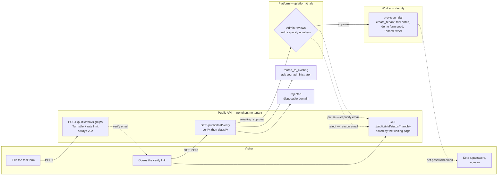
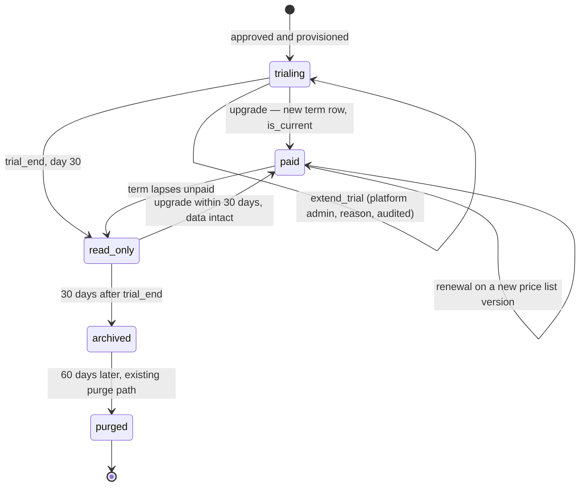
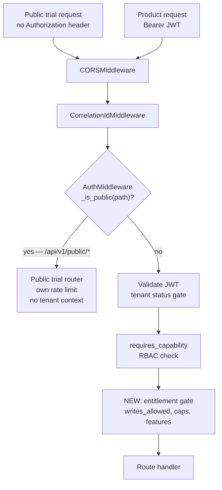

# Self-serve trial — user flow and system design

Status: design only. No code written.
Scope: Prompt 8 in `prompts/roadmap.md`, steps 3 and 4 of the build order in
`docs/proposals/subscription-billing-and-self-serve-trial.md`. That document
stays authoritative for pricing, the rate card, and the meter. This one covers
only the flow a visitor walks, and the API work it needs.

Decisions in § 9 were settled with Mohamed on 2026-08-27.

---

## 1. What we are building

A visitor on the marketing site fills a form, verifies their email, and waits
for a platform admin to approve the request. On approval their tenant is
provisioned and they sign in. The trial then ends in one of three ways: it
expires, it is extended, or it becomes a paid plan.

This is the standard product-led trial pattern with one deliberate change — the
approval gate:

1. Form with no credit card.
2. Double opt-in — the email address is verified before anything is created.
3. **A platform admin approves, pauses or rejects each verified request.**
4. Provisioning then runs asynchronously; the visitor watches a status page.
5. Onboarding inside the product, not more forms outside it.
6. Expiry turns the tenant read-only. Data is kept, not deleted.
7. Upgrade happens inside the product, with sales able to help.

**This conflicts with the roadmap gate.** Prompt 8, criterion 1, says a visitor
who has spoken to no one reaches a working signed-in tenant with no human in the
loop. With the approval gate that is no longer true, and the gate line in
`prompts/roadmap.md` needs rewording before Prompt 8 is called done. The
approval step is the decision; the roadmap text is what has to move.

The reason for the gate is cost and capacity. Every tenant is a Postgres schema
plus a Keycloak group, and a trial that draws a farm starts imagery and weather
fetches that cost real money. Approval caps are 3 tenants a day and 10 a week.

---

## 2. The access boundary

The visitor must never reach the platform admin area. Today that is already
true by construction, and the trial flow must not weaken it.

- Platform access is decided by `platform_role` in the JWT
  (`backend/app/shared/auth/context.py`), read by `AuthMiddleware`
  (`backend/app/shared/auth/middleware.py:150`) and checked by the capability
  registry (`backend/app/shared/rbac/check.py:251`).
- A self-serve owner is created through the same path as an invited owner:
  `TenantUsersService.invite_user(..., tenant_role="TenantOwner")`, called from
  `create_tenant` (`backend/app/modules/tenancy/service.py:462`). That path
  writes a tenant membership and a tenant role. It writes no platform role.
- So every `/api/v1/platform/*` route returns 403 for a trial owner, and the
  frontend platform routes have nothing to render.

Two risks the trial flow introduces:

1. **The public endpoints run with no `RequestContext` at all.** They cannot
   call anything that expects an actor with capabilities. The provisioning task
   runs as a system actor — `create_tenant` already accepts
   `actor_user_id=None`.
2. **The provisioning task must be reachable only from an approval.** Not from
   the signup POST, and not from the verify link. Approval is the only trigger,
   and it carries the approving admin's user id into the audit trail.

---

## 3. The flow, stage by stage

### Diagram — from the form to a signed-in tenant

Dashed arrows are emails. `routed_to_existing` and `rejected` create no tenant
and never reach the queue.

### Stage 1 — the form

Lives on the marketing site (`marketing/src/pages/`, Astro on Cloudflare
Workers). Fields: full name, work email, organisation, country, phone
(optional), accept terms. A Cloudflare Turnstile token is posted with it. The
site is already on Cloudflare, so this needs no third-party script.

There is already a parked pricing page at
`marketing/src/pages/_pricing.astro.parked`. The trial form and that page ship
together.

### Stage 2 — `POST /api/v1/public/trial/signups`

Validates, verifies the Turnstile token, rate-limits by IP and by email domain,
writes a `public.trial_signups` row with status `pending_verification`, and
sends a signed, single-use, expiring verification link.

**Always returns 202 with the same body**, whether or not the address is
already known. Anything else lets a stranger enumerate our customers.

### Stage 3 — `GET /api/v1/public/trial/verify?token=…`

Marks the signup `verified`, then classifies it:

| Condition | Result | Reaches the queue |
|---|---|---|
| Email domain matches an active tenant | `routed_to_existing` — page says to ask their administrator | No |
| Disposable domain on the blocklist | `rejected` | No |
| Everything else, free-mail included | `awaiting_approval` | Yes |

Free-mail addresses go to the queue like any other. Many growers use Gmail. The
automatic checks exist to keep junk off the queue, not to make the decision.

The visitor is told, on the page and in an email, that the request is reviewed
**within one working day**, and is given a status link they can reopen. See
§ 3.2.

### Stage 4 — platform review

A platform admin opens `/platform/trials`, reads the capacity numbers, and
approves, pauses or rejects. Detail in § 3.1.

### Stage 5 — provisioning, in Celery

Triggered by approval only.

1. Generate a slug from the organisation name, with a numeric suffix on
   collision. `create_tenant` raises `SlugAlreadyExistsError` and the router
   turns it into a 409 (`backend/app/modules/tenancy/router.py:113`). A visitor
   must never see that.
2. `create_tenant(initial_tier="free", owner_email=…, actor_user_id=None)`.
3. Write `trial_start = today`, `trial_end = today + 30 days`, and pin
   `price_list_id`.
4. Copy the demo farm seed into the new schema, read-only. See § 3.3.
5. **Report success only when Keycloak provisioning succeeded.** See § 5.
6. Send the set-password email and mark the signup `provisioned`.

### Stage 6 — first sign-in

The owner sets a password, signs in with the `TenantOwner` role, and lands on a
populated demo farm with an "add your farm" step next to it. Trial caps apply
from that first minute: 100 feddan, 2 farms, 5 seats. The demo farm counts
against none of them.

---

### 3.1 The approval screen

`/platform/trials` is a queue, not a monitor. It must answer one question
before an admin clicks anything: **can we afford another tenant right now?**

**Capacity, shown above the queue**

| Number | Why it is there |
|---|---|
| Approved today, against the cap of 3 | The cap that blocks the button |
| Approved this week, against the cap of 10 | The second cap |
| When each cap resets | So a paused request has a date |
| Live trial tenants | The standing cost, not the new one |
| Farms and feddan under trial | What the imagery bill is actually driven by |
| Trials converted, expired and abandoned, last 30 days | Whether the trials are worth the capacity |
| Queue depth, and how long the oldest request has waited | Whether we are meeting the one-working-day promise |
| Failed provisioning, needing a retry | The § 5 failure, made visible |

**Per request, in the row**

Organisation, full name, email, country, phone, signup date, email domain, and
three flags: free-mail, domain seen before, and second request from this
company. Enough to decide without opening anything else.

**Actions**

| Action | What happens | Email |
|---|---|---|
| Approve | Enqueues `provision_trial` | Set your password |
| Approve anyway | Only past a cap. Typed reason required, written to the audit log with both counts | Set your password |
| Pause | Status `paused`. The request stays in the queue and can be approved later | "We are waiting on capacity" — no date promised we cannot keep |
| Reject | Status `rejected`, typed reason required | Short reason and a contact route |

Past the daily or weekly cap, **Approve is disabled** and the screen names the
cap and its reset time. `Approve anyway` stays available with a reason. The cap
is a real limit that a person can knowingly break, and the audit log records
who broke it and why.

Capabilities: `platform.trial.read` to open the screen,
`platform.trial.manage` to act on a row.

### 3.2 What the visitor is told, and when

Silence is what makes people leave, so the system sends mail even when nobody
has clicked.

| Moment | Message |
|---|---|
| Form submitted | "Check your email to confirm your address" |
| Email verified | "Verified. We review new workspaces within one working day. Track it here" — with the status link |
| One working day, still not actioned | Automatic. "Still reviewing, sorry for the wait" |
| Approved | "Your workspace is ready — set your password" |
| Paused | "We are at capacity this week. Your request is held and we will write when it is ready" |
| Rejected | Short reason, and a way to reach a person |
| Trial day 23 (D−7) | "Seven days left" |
| Trial day 29 (D−1) | "One day left" |
| `trial_end` | "Your trial has ended. You can still read everything for 30 days" |

`GET /api/v1/public/trial/status/{handle}` backs the status link and returns
the same state in the same words. Handle is opaque and unguessable.

### 3.3 The demo farm

A trial that starts empty shows nothing until the first imagery pass lands,
which is hours to days. So provisioning copies in a seeded, read-only demo farm
with real imagery, indices, weather and a few alerts.

The seed comes from a **purpose-built demo farm on a real, non-customer AOI**,
run as a normal farm inside a platform-owned tenant. A monthly job exports it as
a fixture, and provisioning copies that fixture into the new schema.

Rules:

- Read-only for every trial role. It is a sample, not their data.
- Excluded from the meter, the caps and the entitlement counts.
- Removed on upgrade, or hidden behind a "show sample data" switch.
- Refreshed monthly. It is never more than 30 days behind, and a visitor never
  sees a last pass from last year.
- No customer data. A field boundary identifies a farm even with the name
  changed, so an anonymised customer copy was rejected.

Cost: one farm's imagery, running continuously.

This is new work with no existing equivalent — a seed export job, a fixture in
the repo, and a copy step in the provisioning task.

---

## 4. The three endings

**Expiry.** The trial runs 30 days. At `trial_end` the tenant becomes
read-only: sign-in works, reads work, every write returns 403 naming the
entitlement, and background jobs write nothing for that tenant. Reminders go out
at D−7 and D−1.

Read-only is **not** a `tenants.status` value. `status` already carries
`suspended` and `pending_delete`, and `AuthMiddleware`
(`backend/app/shared/auth/middleware.py:179`) blocks sign-in outright for both.
Read-only must let people in. It belongs in the entitlement set as
`writes_allowed = false`.

The read-only window is **30 days**. Then the tenant is archived — no sign-in,
data kept — and 60 days after that it enters the existing purge path
(`backend/app/modules/tenancy/service.py:899`).

**Extension.** A platform admin moves `trial_end` forward. The reason is
required and the change is audited with both dates. Capability:
`platform.subscription.manage`.

**Upgrade.** A new `public.tenant_subscriptions` row becomes `is_current`, with
the tier, the pinned price list version, the term, and any negotiated discount.
The trial row stops being current. Block crop pins are written the first time
the block enters the meter. For the first cohort, sales closes the deal and a
platform admin sets the term; self-service payment is out of scope in the
roadmap.

**No backfill on upgrade.** Imagery and weather resume from the upgrade date and
the gap stays a gap, labelled in the timeline. A backfill costs provider and
storage money for a period nobody paid for. The existing backfill console can
run it later for a customer who asks.

### What a trial can do

Trial entitlements equal the paid Subscription tier. The trial is the whole
product for 30 days, not a cut-down product.

| Entitlement | Trial value |
|---|---|
| `max_area_feddan` | 100 feddan, about 42 hectares |
| `max_farms` | 2, so a buyer can compare a good block against a problem block |
| `max_seats` | 5 — owner, agronomist, manager, and a scout on the mobile app |
| `imagery_refresh_cadence_hours` | 24, the same as a paid tenant |
| indices, weather indices, decision trees, recommendations, scouting app, reports export | yes |
| `api_access`, `sso`, `data_residency`, `sla` | no |
| `writes_allowed` | until `trial_end` |

Cost is held by the area cap and the approval gate, not by hiding features. A
prospect who never sees the decision trees has not seen the product.

On the cadence: `tenant_settings.imagery_refresh_cadence_hours` is a **check
interval**, not the satellite revisit. Sentinel-2 lands about every 5 days
whatever we set. Slowing the check would delay the visitor seeing a pass without
saving a proportionate number of provider calls, so a trial checks daily like
everyone else.

---

## 5. The failure that already shipped once

`create_tenant` returns 201 with `keycloak_provisioning: "pending"` and no
error when the Keycloak invite does not land
(`backend/app/modules/tenancy/service.py:487`). On the invite path that meant an
invited user was told to check an email that never arrived. Here it would mean
an admin sees "approved" while the visitor waits for nothing.

The provisioning task must:

- treat anything other than `"succeeded"` as not done,
- keep the signup in `provisioning`,
- retry through the existing `retry_provisioning`
  (`backend/app/modules/tenancy/service.py:544`),
- raise a platform alert after N attempts and surface the row at the top of
  `/platform/trials`,
- and only then show the visitor a "we are finishing your workspace" state with
  a human contact route.

---

## 6. Where a public request goes

`_is_public` already exists (`backend/app/shared/auth/middleware.py:46`) but its
list is five paths — `/health`, `/metrics`, `/docs`, `/redoc`,
`/openapi.json`. Adding the prefix `/api/v1/public/` is the whole change at that
layer. Every other route falls through to the bearer-token branch at line 163.

The entitlement gate is the piece with no substitute. `feature_flags` on
`tenant_subscriptions` (`backend/app/modules/tenancy/models.py:87`) is stored,
displayed, and read by nothing. If the new check does not go through
`requires_capability`, it becomes a second inert flag.

---

## 7. What has to be built or changed

### 7.1 New — public surface

| Item | Where |
|---|---|
| `POST /api/v1/public/trial/signups` → 202 always | new `backend/app/modules/billing/public_router.py` |
| `GET /api/v1/public/trial/verify` → classifies and queues | same |
| `GET /api/v1/public/trial/status/{handle}` → polled by the status page | same |
| `GET /api/v1/public/trial/plans` — published rates for the pricing page (optional) | same |
| Turnstile verification + IP / domain rate limit | new shared helper; nothing like it exists today |
| Disposable-domain blocklist, and the check against active tenant domains | new, same module |
| `public.trial_signups` table and its state column | new Alembic migration |
| `provision_trial` Celery task, triggered by approval only | new `backend/app/modules/billing/tasks.py` |
| Demo farm seed export job + fixture + copy step | new; see § 3.3 |
| Trial clock task — the one-day chase mail, D−7, D−1, `trial_end` to read-only, +30d archive | new, same tasks module |
| Approval cap counters (3/day, 10/week) and the audited override | new, same module |

### 7.2 New — platform surface

| Item | Where |
|---|---|
| `GET /api/v1/platform/trials` — queue plus capacity numbers | new `backend/app/modules/billing/trials_router.py` |
| `POST /api/v1/platform/trials/{id}/approve` — body carries the override reason when past a cap | same |
| `POST /api/v1/platform/trials/{id}/pause` | same |
| `POST /api/v1/platform/trials/{id}/reject` — reason required | same |
| `POST /api/v1/platform/trials/{id}/resend-verification` | same |
| Capacity read model — live trials, farms, feddan, conversion counts | new repository query |

### 7.3 Modify — existing files

| File | Change |
|---|---|
| `backend/app/shared/auth/middleware.py:40` | add `/api/v1/public/` to `_PUBLIC_PREFIXES` |
| `backend/app/core/app_factory.py:198` | mount the public and trials routers; confirm the public one sits outside the tenant-context set |
| `backend/app/modules/tenancy/service.py:376` | accept trial dates and `price_list_id` on create; stop leaving `trial_start` / `trial_end` NULL at `insert_subscription` (line 417) |
| `backend/app/modules/tenancy/service.py:423` | the schema bootstrap runs inline in the request today. Fine for an admin button, not for a queued task. The task owns it now |
| `backend/app/shared/rbac/check.py:251` | add the entitlement check after the capability check |
| `backend/app/modules/tenancy/models.py:68` | new columns on `TenantSubscription` per § 8.1 of the billing plan |
| `backend/app/modules/platform_admins/admins_service.py:113` and `:306` | two copies of the platform-role allow-list — both need `PlatformBillingAdmin` |
| `backend/app/modules/platform_admins/admins_router.py` | five `Literal[...]` annotations carry the platform role list |
| `backend/app/modules/notifications/smtp.py`, `templates.py` | nine new templates, listed in § 3.2 |
| `backend/app/core/settings.py:346` | Turnstile secret, trial defaults, rate limits, approval caps |

### 7.4 New screens

| Screen | Gate |
|---|---|
| `/platform/trials` — the queue, capacity numbers, approve / pause / reject | `platform.trial.read`, `platform.trial.manage` |
| Tenant subscription panel — extend trial with a reason | `platform.subscription.manage` |
| Customer billing page — plan, caps, live usage, days left | `subscription.read` |
| In-app trial banner and read-only state | none — every trial user sees it |
| `marketing/src/pages/trial.astro` — the form | public |
| `marketing/src/pages/trial/check-your-email.astro` | public |
| `marketing/src/pages/trial/status.astro` — polls `/public/trial/status/{handle}` | public |

### 7.5 Email

Keycloak sends the invite and reset mail today
(`backend/app/shared/keycloak/client.py:984`), gated by
`keycloak_smtp_enabled` (`backend/app/core/settings.py:110`). The trial mails
are product mails, not identity mails, so they go through the notifications SMTP
path. That path exists but has never carried a message to a person outside a
tenant. It needs checking before we depend on it — nine templates and a promise
of a reply within one working day both rest on it.

---

## 8. Abuse and cost control

An unauthenticated endpoint is an attack surface even when it creates nothing.
With the approval gate, no schema is created without a named admin, so the
automatic controls now protect the queue and the mail sender rather than the
database.

| Control | Value |
|---|---|
| Signups per IP | 5 per hour |
| Signups per email domain | 3 per day |
| Live trials per verified email | 1 |
| Live trials per organisation domain | 1 |
| Turnstile on the form | required |
| Tenants provisioned per day | 3, admin override with a reason |
| Tenants provisioned per week | 10, admin override with a reason |
| Disposable domains | rejected at verification, never queued |
| Area per trial | 100 feddan |
| Abandoned trial — owner never signs in | archived early, without waiting for `trial_end` |

The demo farm is copied, not fetched, so seeding a trial costs storage, not
provider calls.

---

## 9. Decisions

Settled with Mohamed on 2026-08-27. These close nine of the eleven open
questions in `docs/proposals/subscription-billing-and-self-serve-trial.md` § 15,
and set every number this flow needs.

| # | Question | Decision |
|---|---|---|
| 1 | Auto-provision, or review first? | **Platform admin approval, always.** No tenant is created without one. This reverses an earlier answer in this session and it conflicts with the roadmap gate — see § 1 |
| 2 | Free-mail addresses | **Allowed into the queue.** Only disposable domains are rejected automatically. A domain matching an active tenant routes to "ask your administrator" |
| 3 | Demo farm or empty tenant? | **Seeded read-only demo farm**, from a purpose-built farm on a real non-customer AOI, exported monthly |
| 4 | Which features are in the trial | **The full product for 30 days.** No API access, no SSO |
| 5 | Where the form lives | **Marketing site.** Three Astro pages. The SPA keeps no unauthenticated route |
| 6 | Read-only window | **30 days**, then archive, then purge 60 days later |
| 7 | Backfill the gap on upgrade | **No.** Data resumes from the upgrade date. Manual backfill on request |
| 8 | `D_trial` | **30 days.** Covers about 5 Sentinel-2 passes, so the charts have a line to draw |
| 9 | Trial imagery cadence | **24 hours**, same as paid. The revisit, not the check interval, sets the real cost |
| 10 | `A_free` | **100 feddan**, about 42 hectares. Hitting the cap is a sales signal |
| 11 | `F_free`, `S_free` | **2 farms, 5 seats** |
| 12 | Provisioning caps | **3 a day, 10 a week.** Approve is blocked past a cap; override needs a typed reason and is audited |
| 13 | Cap behaviour | **Blocks with an audited override** |
| 14 | What the waiting visitor is told | **Within one working day**, with a status link and an automatic chase mail if the day passes |

### Still open

| Item | Needed for |
|---|---|
| Who keeps the disposable-domain list current, and from which source | the verify step |
| Whether "one working day" counts weekends, and who covers them | the chase mail and the queue promise |
| Invoicing in-product or handed to an accounting tool | outside this document |
| Currency and tax | outside this document |

---

## 10. How we would know it works

1. A visitor fills the form, verifies, sees "reviewed within one working day",
   and every step is a row in `trial_signups`.
2. No tenant schema exists until a named platform admin clicks approve, and the
   audit log carries that admin's user id.
3. Past 3 approvals in a day, Approve is disabled and names the cap. `Approve
   anyway` writes the reason, both counts and the actor to the audit log.
4. A paused request sends the capacity email, stays in the queue, and can be
   approved the next day without the visitor signing up again.
5. On approval the visitor reaches a signed-in tenant, and the first screen
   shows a populated demo farm whose latest imagery pass is under 30 days old.
6. The demo farm counts against neither the 2-farm cap nor the meter.
7. A second signup from the same company domain routes to "ask your
   administrator" and creates no second tenant. A disposable domain never
   reaches the queue.
8. A trial owner opening `/api/v1/platform/tenants` gets 403 with the capability
   named, and can open a decision tree, a recommendation and a report.
9. Enrolling past 100 feddan, a third farm, or a sixth seat is refused with the
   entitlement named.
10. At day 30 the tenant signs in, reads everything, and every write returns
    403. No imagery, weather or decision-tree job writes for it.
11. Thirty days after that the tenant is archived and sign-in stops.
12. Keycloak refusing the invite leaves the signup in `provisioning`, sends no
    "you are ready" email, and shows at the top of `/platform/trials`.
13. Roadmap Prompt 8, criterion 1, has been reworded to match the approval gate.
